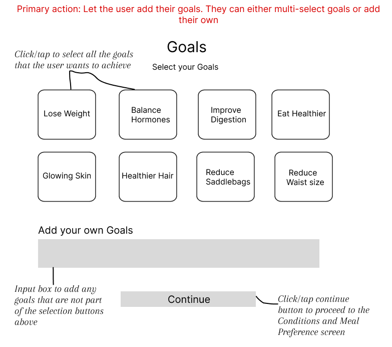
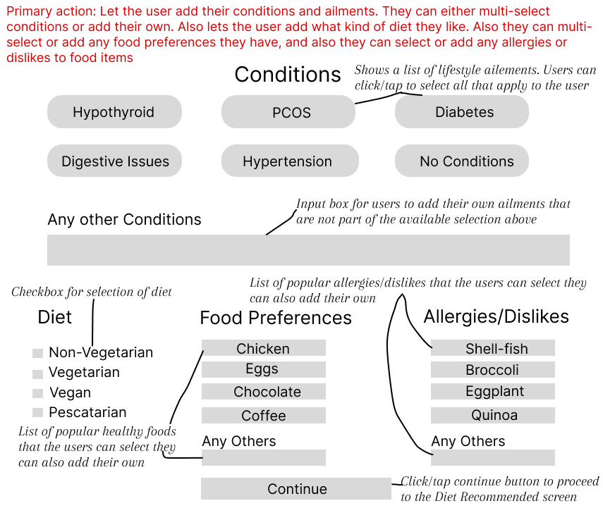
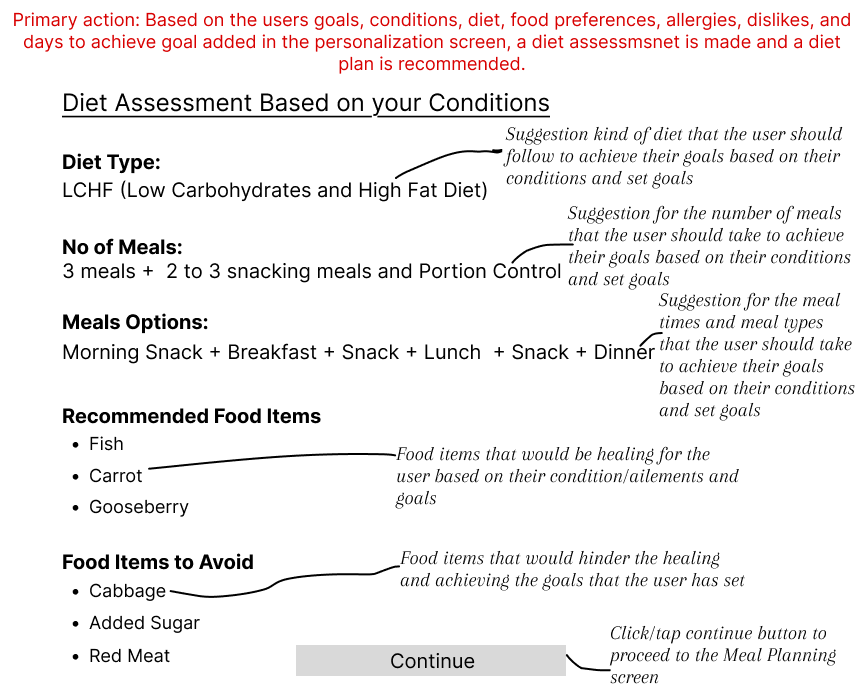
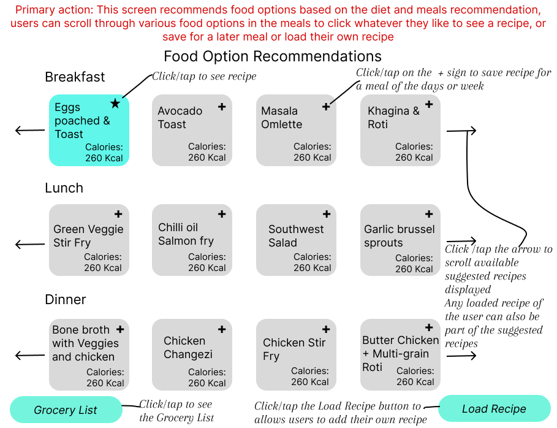
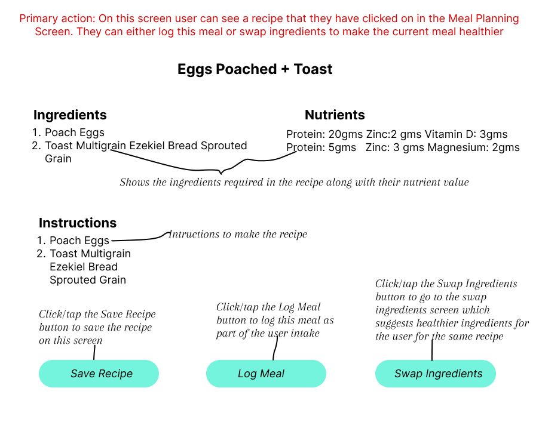
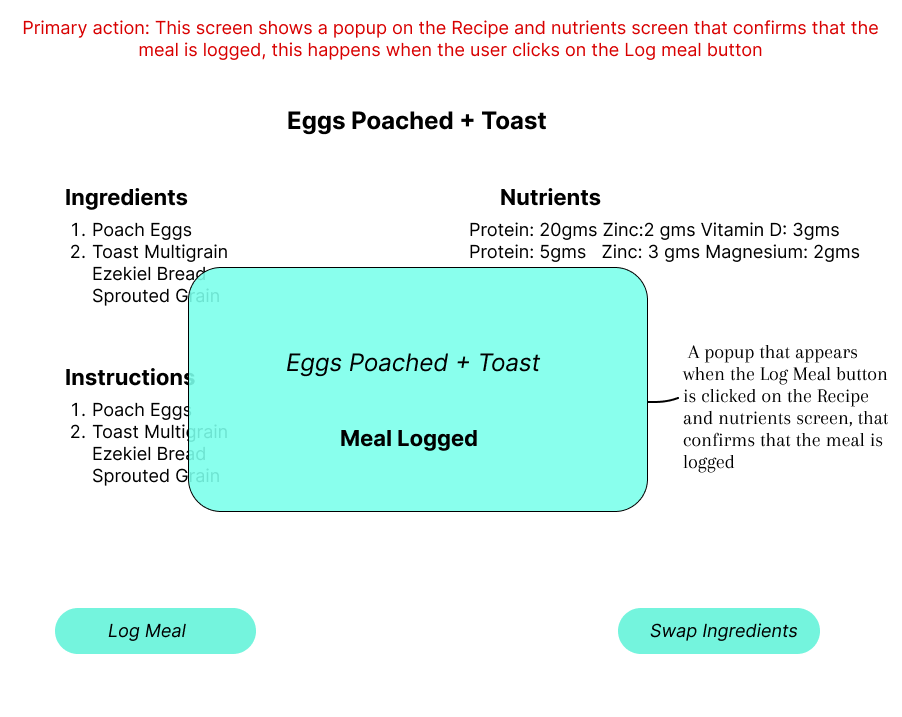
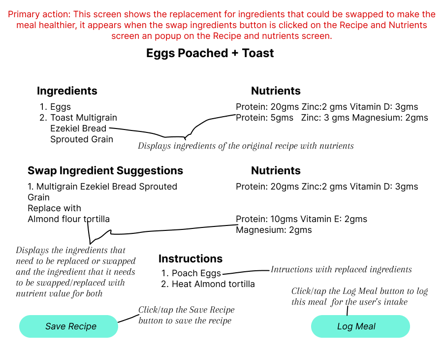
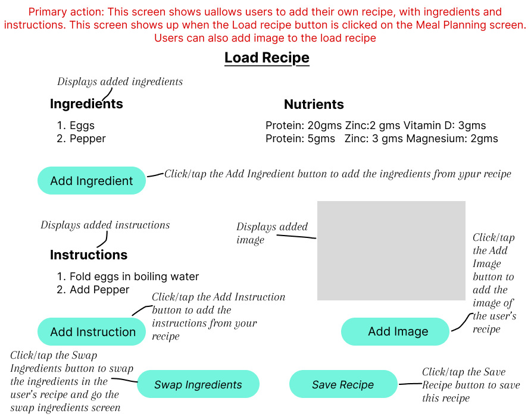
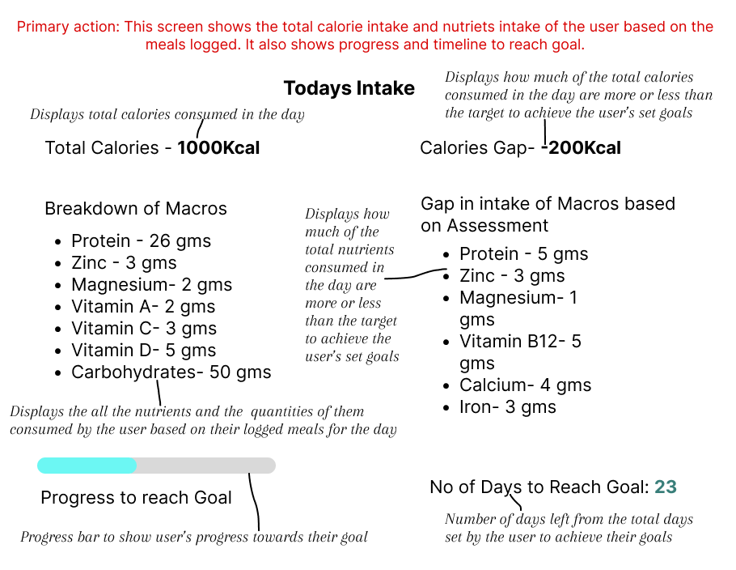
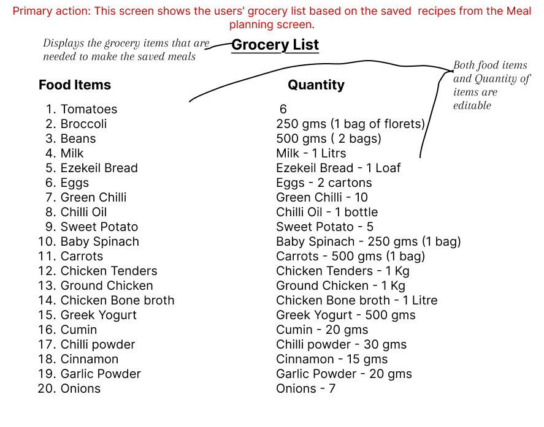

# Wellness Assistance

An AI-powered health and wellness mobile app built with React Native that delivers personalized meal recommendations, healthier recipe swaps, and daily nutrition tracking based on individual goals and health conditions.

## Features

- **User Onboarding**: Multiple authentication options (Gmail, iPhone, Facebook, Email, Guest)
- **Personalization**: Collect user health metrics (weight, height, goals, timeline)
- **Goal Setting**: Multi-select wellness goals with custom goal options
- **Health Assessment**: Track conditions, dietary preferences, food preferences, and allergies
- **AI-Powered Recommendations**: Personalized diet plans using OpenAI GPT-3.5

## Tech Stack

- **Framework**: React Native (Expo)
- **Navigation**: React Navigation v6
- **AI Integration**: OpenAI API (GPT-3.5-turbo)
- **State Management**: React Context API
- **HTTP Client**: Axios

## Project Structure

```
wellness-assistance/
├── App.js                      # Main app entry with navigation
├── app.json                    # Expo configuration
├── package.json                # Dependencies
├── babel.config.js             # Babel configuration
├── src/
│   ├── config/
│   │   └── config.js          # API keys and configuration
│   ├── context/
│   │   └── UserContext.js     # Global user state management
│   ├── services/
│   │   └── openAIService.js   # OpenAI API integration
│   └── screens/
│       ├── WelcomeScreen.js           # Screen 01: Authentication
│       ├── PersonalizationScreen.js   # Screen 02: User metrics
│       ├── GoalsScreen.js             # Screen 03: Goal selection
│       ├── ConditionsScreen.js        # Screen 04: Health & preferences
│       └── RecommendationsScreen.js   # Screen 05: AI recommendations
```

## Setup Instructions

### Prerequisites

- Node.js (v14 or higher)
- npm or yarn
- Expo CLI: `npm install -g expo-cli`
- iOS Simulator (Mac) or Android Emulator

### Installation

1. **Install dependencies**:
   ```bash
   npm install
   ```

2. **Configure OpenAI API Key** (Already configured in `src/config/config.js`):
   - The API key is already set up
   - For production, move this to environment variables

3. **Start the development server**:
   ```bash
   npm start
   # or
   expo start
   ```

4. **Run on device/emulator**:
   - Press `i` for iOS simulator
   - Press `a` for Android emulator
   - Scan QR code with Expo Go app on physical device

## Screen Flow

1. **Welcome Screen**: User selects authentication method
2. **Personalization Screen**: Enter gender, weight, height, and goal timeline
3. **Goals Screen**: Select health goals (weight loss, better skin, etc.)
4. **Conditions & Preferences Screen**: 
   - Select health conditions
   - Choose diet type (vegetarian, vegan, etc.)
   - Specify food preferences and allergies
5. **Recommendations Screen**: View AI-generated personalized diet plan
6. **Meal Planning Screen**: Browse and select meals based on recommendations
7. **Recipe & Nutrients Screen**: View detailed recipe information and nutritional breakdown
8. **Log Meal Confirmation**: Confirm meal logging
9. **Swap Ingredients Screen**: Get healthier ingredient alternatives
10. **Load Recipe Screen**: Add custom recipes with ingredients and instructions
11. **Today's Metrics Screen**: Track daily calorie and nutrient intake
12. **Groceries Screen**: View and manage shopping list from saved recipes

## Screenshots

### 01. Welcome Screen

*Authentication options and app entry point*

### 02. Personalization Screen

*User profile setup with health metrics*

### 03. Goals Screen

*Select wellness goals and objectives*

### 04. Conditions & Preferences Screen

*Health conditions, diet type, and food preferences*

### 05. AI Recommendations Screen

*Personalized diet plan generated by AI*

### 06. Meal Planning Screen

*Browse meal options based on your diet plan*

### 07. Recipe & Nutrients Screen

*Detailed recipe with ingredients and nutritional information*

### 08. Log Meal Confirmation

*Confirmation popup when logging a meal*

### 09. Swap Ingredients Screen

*Healthier ingredient alternatives with nutritional comparisons*

### 10. Load Recipe Screen

*Add your own custom recipes*

### 11. Today's Metrics Screen

*Daily calorie and nutrient tracking*

### 12. Groceries Screen

*Shopping list from saved recipes with add/save functionality*

## OpenAI Integration

The app uses OpenAI's GPT-3.5-turbo model to generate personalized diet recommendations based on:
- User health metrics (weight, height, BMI goals)
- Health conditions (PCOS, diabetes, thyroid, etc.)
- Dietary preferences (vegetarian, vegan, pescatarian, etc.)
- Food preferences and allergies
- Timeline to achieve goals

The AI provides:
- Recommended diet type (LCHF, Mediterranean, etc.)
- Meal frequency and timing
- Meal schedule suggestions
- Recommended foods for healing
- Foods to avoid
- Rationale for the recommendations

## Development Notes

### Current Features
- ✅ Complete UI for all 5 screens
- ✅ Navigation between screens
- ✅ User data collection and state management
- ✅ OpenAI API integration for diet recommendations
- ✅ Loading states and error handling

### Future Enhancements
- [ ] Actual authentication implementation (Firebase/Auth0)
- [ ] Database integration for saving user profiles
- [ ] Meal planning screen with calendar
- [ ] Food logging and nutrition tracking
- [ ] Recipe recommendations
- [ ] Progress tracking and analytics
- [ ] Push notifications for meal reminders

## API Key Security

⚠️ **Important**: The OpenAI API key is currently hardcoded in `src/config/config.js` for development purposes. For production:

1. Use environment variables
2. Store API key securely on backend
3. Make API calls through your backend server
4. Never commit API keys to version control

## Troubleshooting

### Common Issues

1. **Expo not starting**: 
   - Clear cache: `expo start -c`
   
2. **OpenAI API errors**:
   - Verify API key is valid
   - Check internet connection
   - Ensure API key has sufficient credits

3. **Navigation errors**:
   - Ensure all dependencies are installed
   - Try: `npm install --legacy-peer-deps`

## Support

For issues or questions, please check:
- [React Native Documentation](https://reactnative.dev/)
- [Expo Documentation](https://docs.expo.dev/)
- [OpenAI API Documentation](https://platform.openai.com/docs)

## License

This project is for educational and demonstration purposes.
