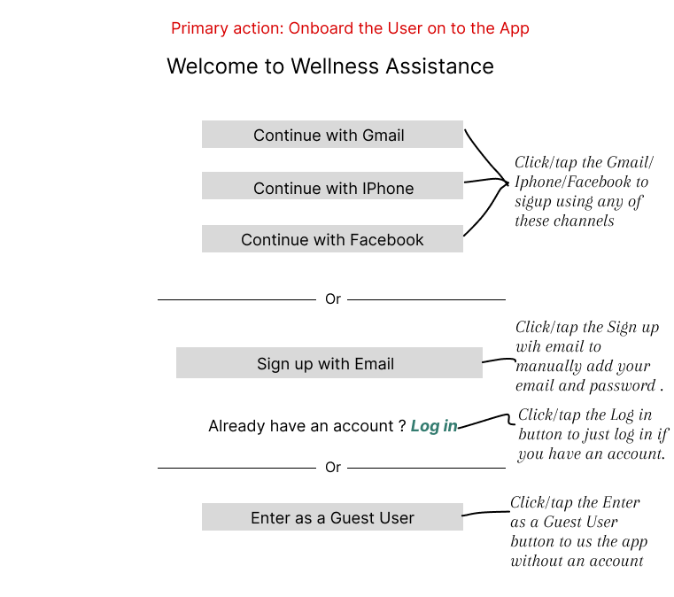
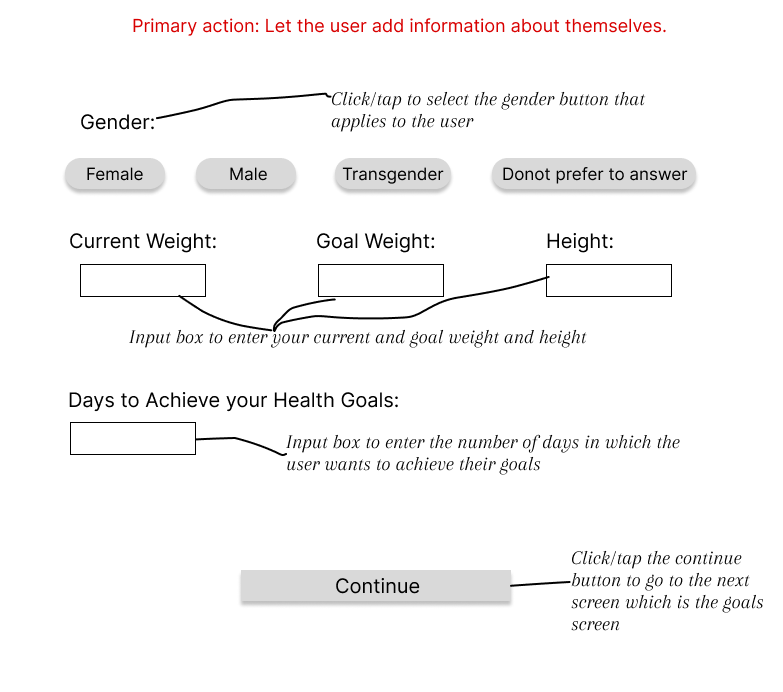

# 📸 Screenshots Successfully Added!

## ✅ COMPLETED TASKS

### All 12 App Screenshots Added to README.md

All screen images have been successfully:
1. ✅ Copied to `screenshots/` folder
2. ✅ Renamed with proper naming convention
3. ✅ Added to README.md in numbered order (01-12)
4. ✅ Committed to git repository
5. ✅ Pushed to GitHub

---

## 📂 SCREENSHOT FILES

All images are stored in: `/screenshots/`

| # | File Name | Screen | Size |
|---|-----------|--------|------|
| 01 | `01_welcome_screen.png` | Welcome Screen | 49.7 KB |
| 02 | `02_personalization_screen.png` | Personalization Screen | 48.7 KB |
| 03 | `03_goals_screen.png` | Goals Screen | 45.3 KB |
| 04 | `04_conditions_screen.png` | Conditions & Preferences | 91.1 KB |
| 05 | `05_recommendations_screen.png` | AI Recommendations | 94.1 KB |
| 06 | `06_meal_planning_screen.png` | Meal Planning | 92.7 KB |
| 07 | `07_recipe_nutrients_screen.png` | Recipe & Nutrients | 73.0 KB |
| 08 | `08_log_meal_confirmation.png` | Log Meal Confirmation | 58.8 KB |
| 09 | `09_swap_ingredients_screen.png` | Swap Ingredients | 87.1 KB |
| 10 | `10_load_recipe_screen.png` | Load Recipe | 85.0 KB |
| 11 | `11_todays_metrics_screen.png` | Today's Metrics | 92.7 KB |
| 12 | `12_groceries_screen.png` | Groceries Screen | 80.1 KB |

**Total:** 12 screenshots, ~858 KB

---

## 📝 README.md STRUCTURE

The README.md now includes a complete **Screenshots** section with:

```markdown
## Screenshots

### 01. Welcome Screen

*Authentication options and app entry point*

### 02. Personalization Screen

*User profile setup with health metrics*

... (continues for all 12 screens)
```

Each screenshot includes:
- ✅ Numbered heading (01-12)
- ✅ Descriptive title
- ✅ Image display via markdown
- ✅ Caption explaining the screen's purpose

---

## 🎯 SCREEN ORDER

The screenshots appear in the correct user flow order:

### User Onboarding & Setup (Screens 01-04)
1. Welcome Screen - Authentication options
2. Personalization Screen - Health metrics input
3. Goals Screen - Wellness goals selection
4. Conditions & Preferences - Health conditions and dietary preferences

### AI Recommendations (Screen 05)
5. AI Recommendations Screen - Personalized diet plan

### Meal Management (Screens 06-10)
6. Meal Planning Screen - Browse meal options
7. Recipe & Nutrients Screen - Detailed recipe view
8. Log Meal Confirmation - Meal logging popup
9. Swap Ingredients Screen - Healthier alternatives
10. Load Recipe Screen - Add custom recipes

### Tracking & Shopping (Screens 11-12)
11. Today's Metrics Screen - Daily nutrition tracking
12. Groceries Screen - Shopping list from saved recipes

---

## 🔗 LINKS

**GitHub Repository:**  
https://github.com/AnvitaRS-PM/wellness-assistance

**View README with Screenshots:**  
https://github.com/AnvitaRS-PM/wellness-assistance/blob/main/README.md

**Screenshots Folder:**  
https://github.com/AnvitaRS-PM/wellness-assistance/tree/main/screenshots

---

## 📊 GIT COMMITS

1. **338004d** - DOCS: Add Screenshots section to README with placeholders
2. **a2bcec1** - ASSETS: Add all 12 app screenshots in order

---

## ✨ RESULT

Your README.md now has a professional **Screenshots** section that:

✅ Shows all 12 screens in order  
✅ Has descriptive captions  
✅ Follows markdown image syntax  
✅ Uses proper file paths  
✅ Is ready for GitHub viewing  

When viewed on GitHub, users will see all your app screens beautifully displayed in sequence!

---

**Status:** ✅ COMPLETE  
**Date:** January 24, 2026  
**Screenshots Added:** 12/12
